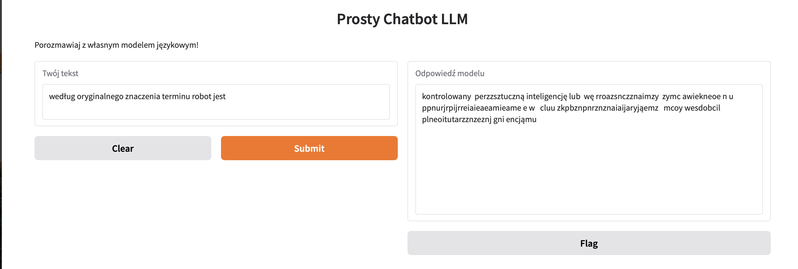
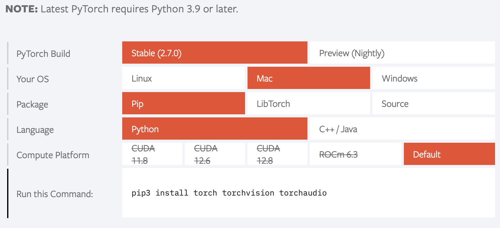

# LLM Tutorial – Prosty model językowy od podstaw

## 📚 Opis projektu

W tym tutorialu budujemy od podstaw prosty model językowy (character-level LLM) oparty na sieci neuronowej z warstwą embedding i warstwami liniowymi (MLP).

> **Uwaga:**  
> Celem projektu **nie jest stworzenie w pełni funkcjonalnego modelu LLM** na miarę GPT, Claude czy innych nowoczesnych modeli generatywnych.  
> To praktyczne wprowadzenie, które pozwala zrozumieć, jak działają podstawowe mechanizmy sieci neuronowych do przetwarzania języka naturalnego:  
> - jak przygotować dane tekstowe do uczenia maszynowego,  
> - jak zakodować tekst na liczby,  
> - jak zbudować i wytrenować własny, prosty model językowy,  
> - jak monitorować postępy treningu i generować tekst,  
> - jak testować i eksperymentować z własnym modelem.

Projekt jest idealny dla osób, które chcą **poznać fundamenty działania LLM** i zrozumieć, co dzieje się „pod maską” dużych modeli językowych – bez konieczności korzystania z gotowych, czarnych skrzynek.

## Demo

Po uruchomieniu aplikacji Gradio możesz w prosty sposób eksperymentować z własnym, wytrenowanym modelem językowym – wpisz tekst startowy nawiązujący do danych/tekstów treningowych, a model wygeneruje dalszy ciąg na podstawie poznanego korpusu.  
Ten przykład pokazuje, jak działa generowanie tekstu przez sieć neuronową i jak model uczy się języka „od zera”.



---

## 🗂️ Struktura repozytorium

```
.
├── model.pth         # Wytrenowany model transformerowy (zapisany przez notebook)
├── data/
│   └── raw/
│       └── sample.txt            # Przykładowy korpus tekstowy do treningu
├── notebooks/
│   └── 01_simple_char_llm.ipynb  # Wprowadzenie, teoria, prosty model LLM
├── README.md
```

## 🚀 Jak uruchomić projekt?

1. **Klonuj repozytorium:**
   ```bash
   git clone https://github.com/SebastianSebastianB/llm-from-scratch.git
   ```

2. **Zainstaluj wymagane biblioteki:**
Zalecane jest użycie środowiska wirtualnego:

```bash
python -m venv venv
venv\Scripts\activate  # Windows
# source venv/bin/activate  # Linux/Mac
```
   - Python 3.x
   - PyTorch (instalacja pakietu `torch` zależy od systemu operacyjnego oraz sprzętu – jeśli masz kartę graficzną NVIDIA i chcesz korzystać z akceleracji GPU, odwiedź [oficjalną stronę PyTorch](https://pytorch.org/get-started/locally/) i wygeneruj odpowiednią komendę instalacyjną dla swojego środowiska.  
   Przykładowa instalacja na CPU - Linux/Mac/Windows):
   ```bash
    pip install torch torchvision torchaudio
   ```
   Jeśli posiadasz GPU NVIDIA, wybierz wersję z obsługą CUDA zgodną z Twoimi sterownikami.
   - Jupyter Notebook
   - gradio



3. **Uruchom Jupyter Notebook:**

   Otwórz `notebooks/01_intro.ipynb` i wykonaj wszystkie komórki.

## 📝 Zawartość notebooków

- **01_intro.ipynb**  
  - Krótkie wprowadzenie do sieci neuronowych i LLM
  - Przygotowanie i tokenizacja danych tekstowych
  - Implementacja prostego modelu językowego (char-level) z warstwą embedding i warstwami liniowymi (MLP)
  - Trening, generowanie tekstu, eksperymenty, prosty interfejs chatbota

## 📂 Dane

W katalogu `data/raw/` znajduje się plik `sample.txt` – przykładowy korpus tekstowy do treningu modeli zaczerpnięty z [Robot](https://pl.wikipedia.org/wiki/Robot)

## 🔗 Przydatne linki
- [Robot - Wiki](https://pl.wikipedia.org/wiki/Robot)
- [Robot medyczny - Wiki](https://pl.wikipedia.org/wiki/Robot_medyczny)
- [PyTorch](https://pytorch.org)
- [Gradio](https://www.gradio.app/)

## Autor i licencja

Autor: [Sebastian Bartel](https://github.com/SebastianSebastianB)  
Licencja: MIT

---